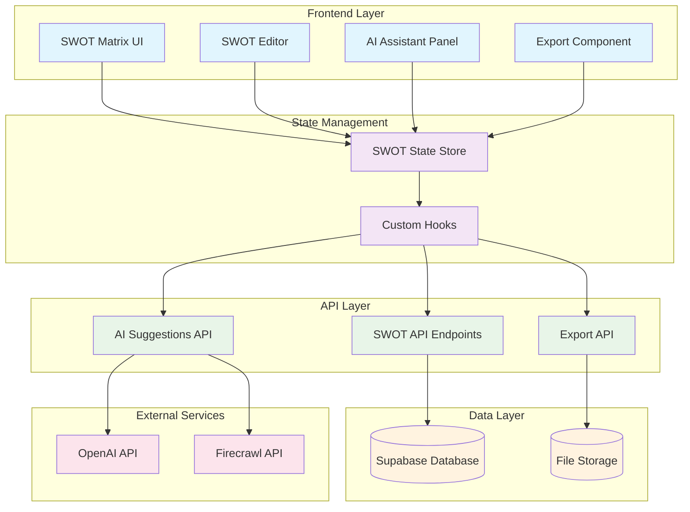
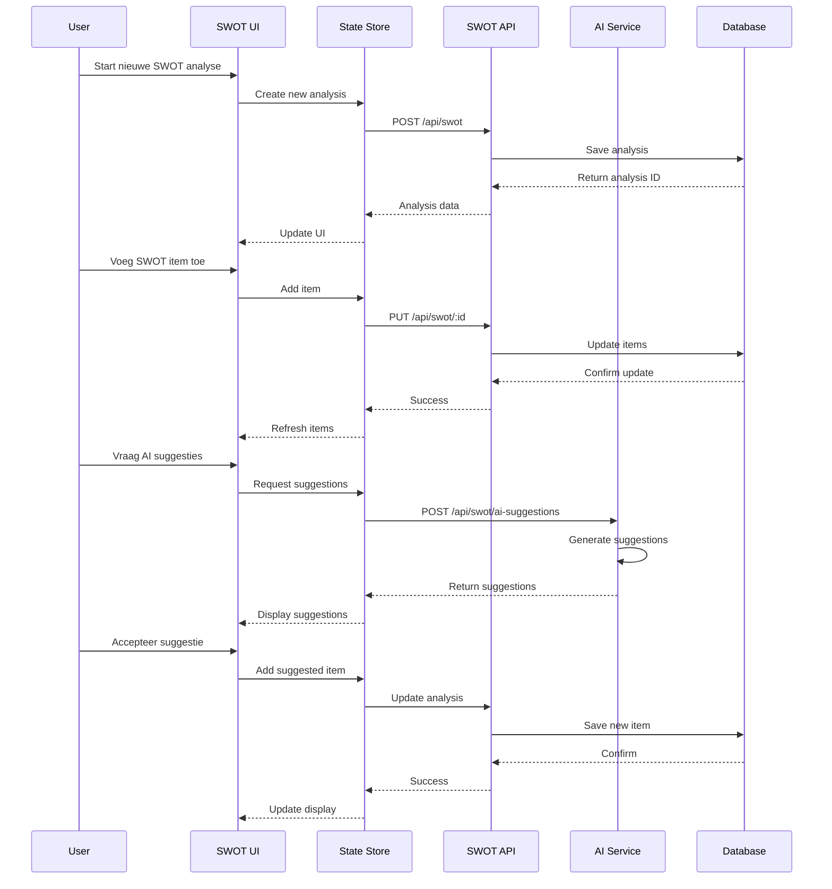
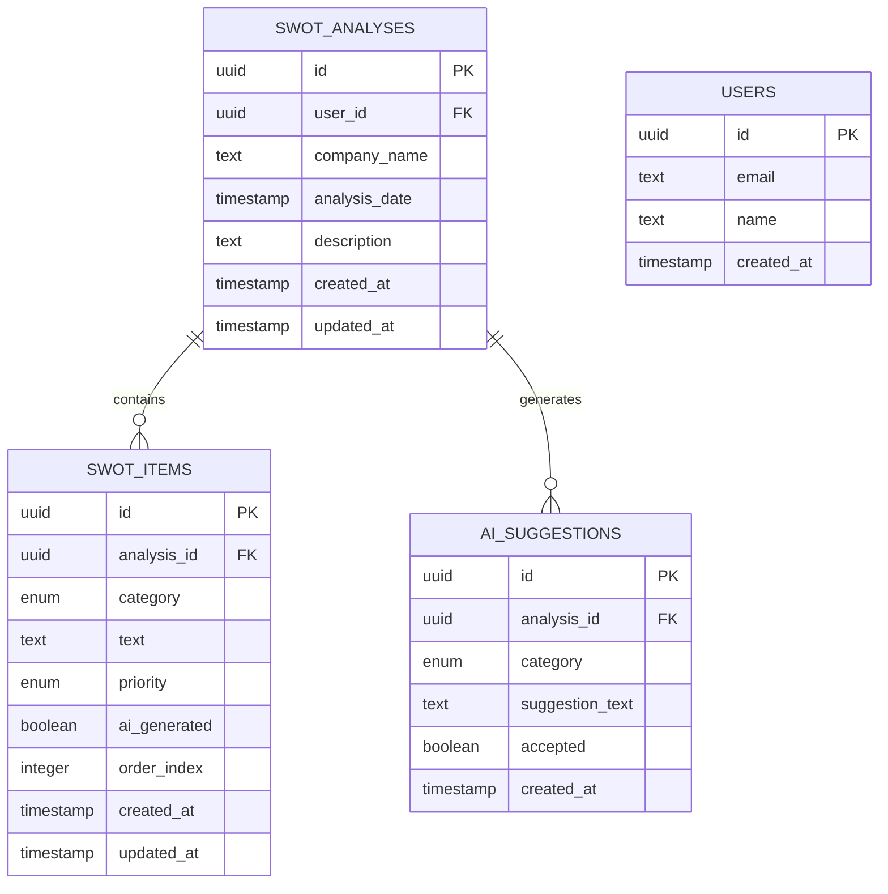
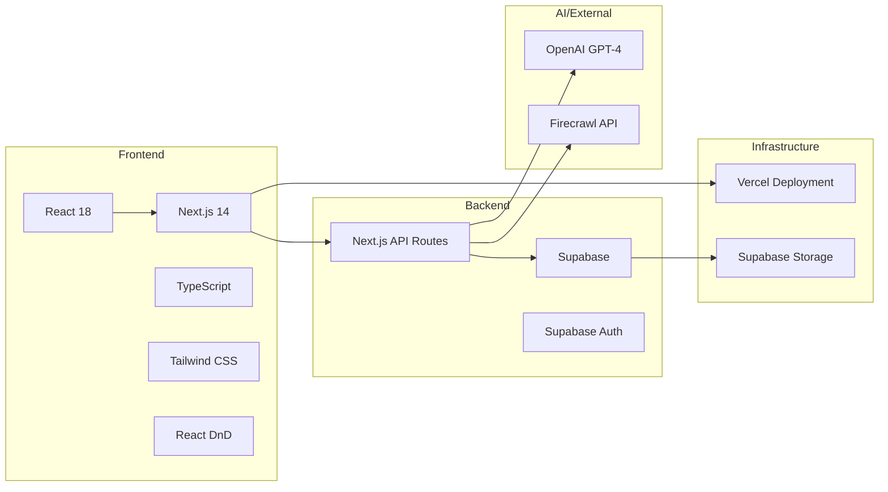
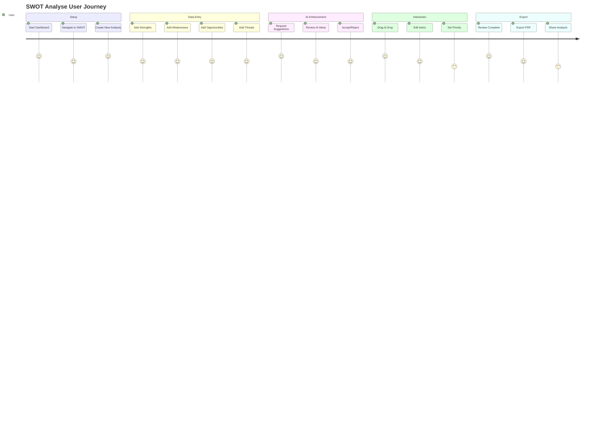
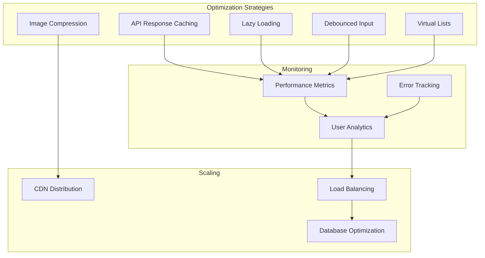

# SWOT Analyse Architectuur Diagram

## System Architecture



## Component Flow



## Data Model



## Technology Stack



## User Interaction Flow



## Performance Considerations



## Security Architecture

```mermaid
graph TB
    subgraph "Authentication"
        Auth[Supabase Auth]
        JWT[JWT Tokens]
        Session[Session Management]
    end
    
    subgraph "Authorization"
        RBAC[Role-Based Access]
        Permissions[Permission Checks]
        Ownership[Data Ownership]
    end
    
    subgraph "Data Protection"
        Encrypt[Encryption at Rest]
        Transit[Encryption in Transit]
        Backup[Secure Backups]
    end
    
    subgraph "API Security"
        Rate[Rate Limiting]
        Validate[Input Validation]
        CORS[CORS Policy]
    end
    
    Auth --> JWT
    JWT --> Session
    Session --> RBAC
    RBAC --> Permissions
    Permissions --> Ownership
    
    Ownership --> Encrypt
    Encrypt --> Transit
    Transit --> Backup
    
    Backup --> Rate
    Rate --> Validate
    Validate --> CORS